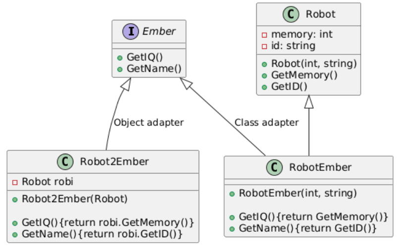

# Adapter Design Pattern

## 1. Adapter Pattern

### Basic Information
The **Adapter Pattern** is a structural design pattern that allows objects with **incompatible interfaces** to work together.

It acts as a **bridge between two incompatible interfaces** by converting the interface of one class into another interface that the client expects.

In simple terms:
> The Adapter lets you use an existing class **without modifying its code**.

---

### When to Use
Use the Adapter pattern when:

- You want to use an existing class, but its interface **does not match** what you need.
- You want to **reuse legacy code**.
- You want to integrate **third-party libraries** into your system.
- You need to make **incompatible classes work together**.

Example use cases:
- Integrating old (legacy) systems
- Wrapping external APIs
- Converting data formats
- Plugging new components into existing systems

---

### Problem Without Adapter

You have:
- A **client** that expects a specific interface
- A **service class** that has a different interface

Without Adapter, you would need to:
- Modify the existing class (often not possible), OR
- Rewrite code (bad practice)

---

### Solution

Create an **Adapter class** that:
- Implements the **expected interface**
- Wraps the **existing class**
- Translates calls from the client into calls to the service

---

### How to Use

1. Identify the **target interface** (what the client expects).
2. Identify the **adaptee** (existing class).
3. Create an **Adapter class** that implements the target interface.
4. Inside the adapter, **delegate calls** to the adaptee.

---

### UML Structure



---

### Example (Java)

```java
// Target interface (what client expects)
interface MediaPlayer {
    void play(String audioType, String fileName);
}

// Adaptee (existing class with incompatible interface)
class AdvancedMediaPlayer {
    public void playVlc(String fileName) {
        System.out.println("Playing VLC file: " + fileName);
    }

    public void playMp4(String fileName) {
        System.out.println("Playing MP4 file: " + fileName);
    }
}

// Adapter
class MediaAdapter implements MediaPlayer {

    private AdvancedMediaPlayer advancedPlayer;

    public MediaAdapter() {
        advancedPlayer = new AdvancedMediaPlayer();
    }

    @Override
    public void play(String audioType, String fileName) {

        if (audioType.equalsIgnoreCase("vlc")) {
            advancedPlayer.playVlc(fileName);
        } else if (audioType.equalsIgnoreCase("mp4")) {
            advancedPlayer.playMp4(fileName);
        } else {
            System.out.println("Format not supported");
        }
    }
}
