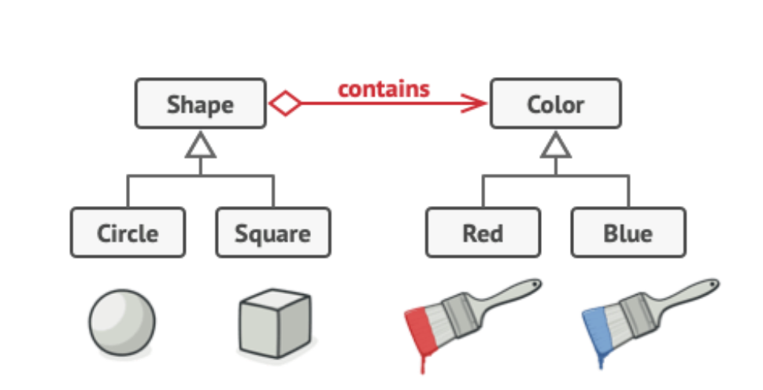

# Bridge Design Pattern

## 1. Bridge Pattern

### Basic Information
The **Bridge Pattern** is a structural design pattern that **decouples an abstraction from its implementation**, so that the two can vary independently.

Instead of creating a large number of subclasses for every combination, the pattern splits the system into:
- **Abstraction** (high-level logic)
- **Implementation** (low-level details)

These two parts are connected using **composition instead of inheritance**.

---

### When to Use
Use the Bridge pattern when:

- You want to **avoid a combinatorial explosion of classes**.
- You need to **separate abstraction and implementation**.
- Both abstraction and implementation may **change independently**.
- You want to **switch implementations at runtime**.

Example use cases:
- Remote controls and devices (TV, Radio)
- UI themes and components
- Drawing APIs (shape + rendering engine)
- Cross-platform applications

---

### Problem Without Bridge

Without the Bridge pattern, combining features leads to many classes:

- `CircleRed`
- `CircleBlue`
- `SquareRed`
- `SquareBlue`

This quickly becomes unmanageable as features grow.

---

### Solution

Split the system into two hierarchies:

1. **Abstraction** → defines high-level control
2. **Implementor** → defines low-level operations

They are connected via a reference.

---

### How to Use

1. Create an **Implementor interface**.
2. Create **Concrete Implementations**.
3. Create an **Abstraction class** that holds a reference to the implementor.
4. Extend the abstraction if needed.
5. Delegate work from abstraction t# Bridge Design Pattern

## 1. Bridge Pattern

### Basic Information
The **Bridge Pattern** is a structural design pattern that **decouples an abstraction from its implementation**, so that the two can vary independently.

Instead of creating a large number of subclasses for every combination, the pattern splits the system into:
- **Abstraction** (high-level logic)
- **Implementation** (low-level details)

These two parts are connected using **composition instead of inheritance**.

---

### When to Use
Use the Bridge pattern when:

- You want to **avoid a combinatorial explosion of classes**.
- You need to **separate abstraction and implementation**.
- Both abstraction and implementation may **change independently**.
- You want to **switch implementations at runtime**.

Example use cases:
- Remote controls and devices (TV, Radio)
- UI themes and components
- Drawing APIs (shape + rendering engine)
- Cross-platform applications

---

### Problem Without Bridge

Without the Bridge pattern, combining features leads to many classes:

- `CircleRed`
- `CircleBlue`
- `SquareRed`
- `SquareBlue`

This quickly becomes unmanageable as features grow.

---

### Solution

Split the system into two hierarchies:

1. **Abstraction** → defines high-level control
2. **Implementor** → defines low-level operations

They are connected via a reference.

---

### How to Use

1. Create an **Implementor interface**.
2. Create **Concrete Implementations**.
3. Create an **Abstraction class** that holds a reference to the implementor.
4. Extend the abstraction if needed.
5. Delegate work from abstraction to implementation.

---

### UML Structure



---

### Example (Java)

```java
// Implementor
interface Device {
    void turnOn();
    void turnOff();
}

// Concrete Implementations
class TV implements Device {
    public void turnOn() {
        System.out.println("TV ON");
    }

    public void turnOff() {
        System.out.println("TV OFF");
    }
}

class Radio implements Device {
    public void turnOn() {
        System.out.println("Radio ON");
    }

    public void turnOff() {
        System.out.println("Radio OFF");
    }
}

// Abstraction
class RemoteControl {
    protected Device device;

    public RemoteControl(Device device) {
        this.device = device;
    }

    public void turnOn() {
        device.turnOn();
    }

    public void turnOff() {
        device.turnOff();
    }
}

// Refined Abstraction
class AdvancedRemoteControl extends RemoteControl {

    public AdvancedRemoteControl(Device device) {
        super(device);
    }

    public void mute() {
        System.out.println("Muted");
    }
}o implementation.

---

### UML Structure


---

### Example (Java)

```java
// Implementor
interface Device {
    void turnOn();
    void turnOff();
}

// Concrete Implementations
class TV implements Device {
    public void turnOn() {
        System.out.println("TV ON");
    }

    public void turnOff() {
        System.out.println("TV OFF");
    }
}

class Radio implements Device {
    public void turnOn() {
        System.out.println("Radio ON");
    }

    public void turnOff() {
        System.out.println("Radio OFF");
    }
}

// Abstraction
class RemoteControl {
    protected Device device;

    public RemoteControl(Device device) {
        this.device = device;
    }

    public void turnOn() {
        device.turnOn();
    }

    public void turnOff() {
        device.turnOff();
    }
}

// Refined Abstraction
class AdvancedRemoteControl extends RemoteControl {

    public AdvancedRemoteControl(Device device) {
        super(device);
    }

    public void mute() {
        System.out.println("Muted");
    }
}
